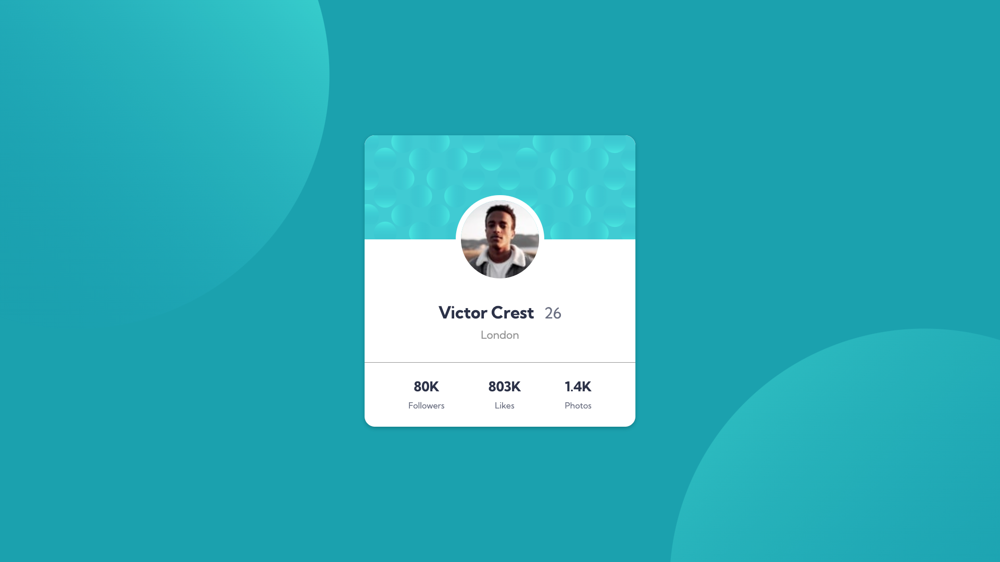
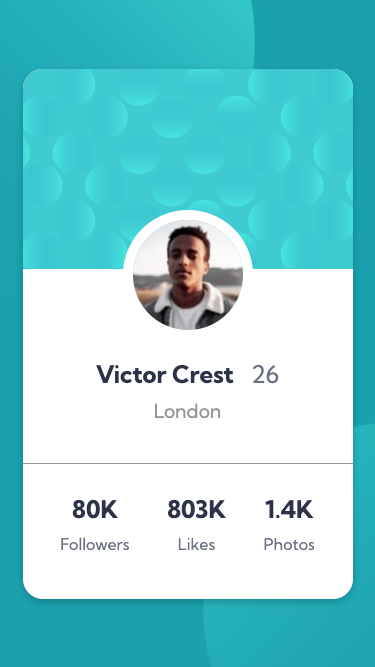

# Frontend Mentor - Profile card component solution

This is a solution to the [Profile card component challenge on Frontend Mentor](https://www.frontendmentor.io/challenges/profile-card-component-cfArpWshJ). Frontend Mentor challenges help you improve your coding skills by building realistic projects. 

## Table of contents

- [Overview](#overview)
  - [The challenge](#the-challenge)
  - [Screenshot](#screenshot)
  - [Links](#links)
- [My process](#my-process)
  - [Built with](#built-with)
  - [What I learned](#what-i-learned)
  - [Continued development](#continued-development)
- [Author](#author)


## Overview

### The challenge

- Build out the project to the designs provided

### Screenshot
- Desktop view


- Mobile view

  


### Links

- Solution URL: [GitHub](https://github.com/EshrakRahman/Frontend-Mentor---Profile-card-component)
- Live Site URL: [GitHub page](https://eshrakrahman.github.io/Frontend-Mentor---Profile-card-component/)


## My process

### Built with

- Semantic HTML5 markup
- CSS custom properties
- Flexbox
- CSS Grid
- Desktop-first workflow


### What I learned

I recently completed a newbie challenge on FrontendMasters, diving deep into the world of CSS Flexbox. Before this, positioning items in dynamic layouts felt complex. Flexbox, however, transformed my approach, offering a streamlined method to align and distribute elements within a container. Through properties like justify-content, align-items, and flex-direction, I mastered the art of creating responsive and visually appealing designs. This wasn't just about grasping a theoretical concept; it was hands-on learning, giving me the confidence to tackle modern web design challenges with a fresh perspective.
To see how you can add code snippets, see below:

```html
<div class="img-wrapper">
  
  
</div>
<div class="card">
  <div class="grid-container">
    <div class="card-top">
      <div class="img-wrapper">
        
      </div>

    </div>
    <div class="card-bottom">
      <div class="profile-img">
        
      </div>
      <div class="profile-details">
        <h1 class="name">
          Victor Crest <span>26</span>
        </h1>
        <p class="address">London</p>
      </div>
      <div class="line">
      </div>
      <div class="profile-stats">
        <div class="followers">
          <h2>80K</h2>
          <p>Followers</p>
        </div>
        <div class="likes">
          <h2>803K</h2>
          <p>Likes</p>
        </div>
        <div class="photos">
          <h2>1.4K</h2>
          <p>Photos</p>
        </div>
      </div>
    </div>
  </div>
</div>
```
```css
  #main {
  display: flex;
  justify-content: center;
  align-items: center;
  width: 100%;
  height: 1080px;
  overflow: hidden;
  }
  main .img-wrapper .top-img {
  position: absolute;
  left: -345px;
  top: -345px;
  z-index: 1;
  }
  
  main .img-wrapper .bottom-img {
  position: absolute;
  right: -343px;
  bottom: -529px;
  z-index: 1;
  }
```


### Continued development

Having tackled FrontendMasters' challenge, I delved into CSS Flexbox, streamlining complex layouts with newfound mastery. Using pivotal properties, I now confidently craft responsive designs, a testament to my hands-on growth in modern web design. My continuous development highlights my resilience and adaptabilit


## Author

- Website - [@eshrakrahman](https://www.github.com/eshrakrahman)
- Frontend Mentor - [@eshrakrahman](https://www.frontendmentor.io/profile/eshrakrahman)
- Twitter - [@rahman_eshrak](https://www.twitter.com/rahman_eshrak)

